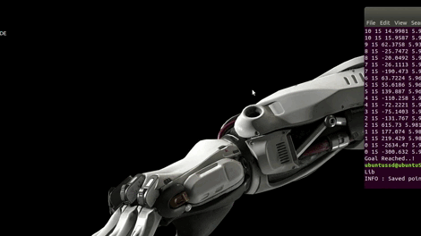
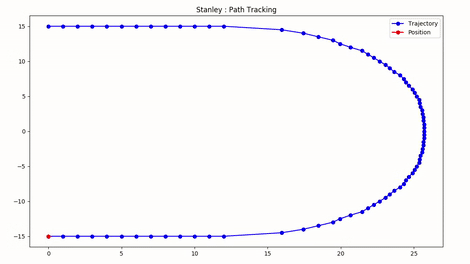

# Path-Tracking-Algorithms
C++ Implementation of Robotics Path Tracking Algorithms - Pure Pursuit, Stanley

## Requirements
### [Matplotlib-cpp](https://github.com/lava/matplotlib-cpp)

## Path Tracking - MatplotLibCpp

  ### Pure Pursuit
  

  ### Stanley
  

## Implementation - Gazebo
Successfully implemented all the algorithms on TurtleBot3(Waffle) in Gazebo Simulation.

Click to view video!

  #### 
  #### 
